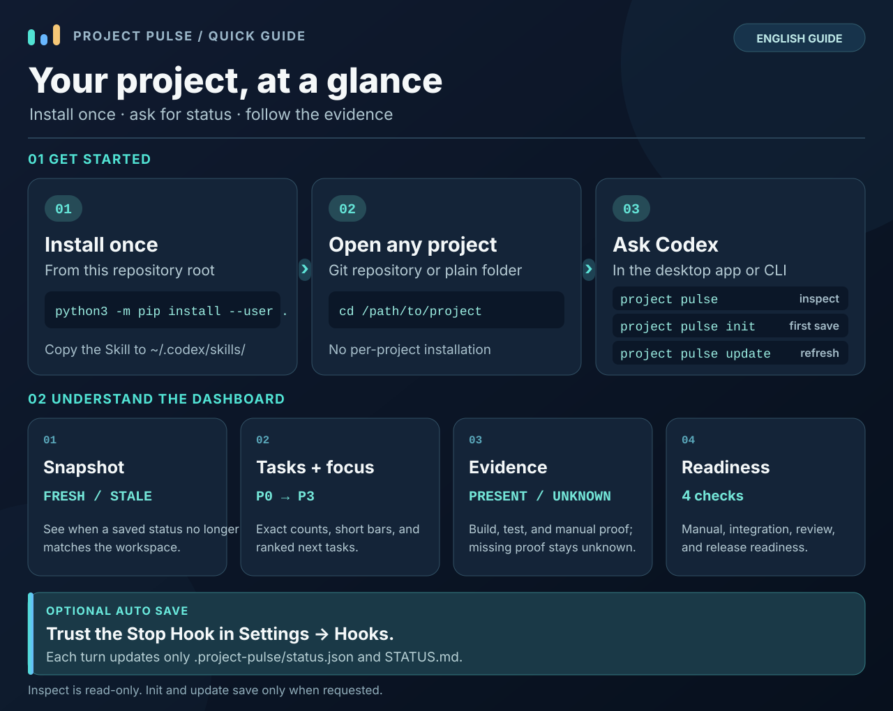

# Project Pulse

**Evidence-based project status for coding agents.** Know what is implemented, what has current verification evidence, and what needs attention next.

[简体中文](README.zh-CN.md)

Project Pulse combines a reusable Agent Skill with a deterministic Python CLI. It reads the current project, groups tasks by state, highlights the most urgent items, and reports evidence and readiness without guessing a completion percentage. **Inspect works immediately and does not write to the project.**

## Quick start

### 1. Install once per machine

Requires Python 3.9+. The commands below use a POSIX shell (macOS, Linux, or Git Bash). Clone the repository, then install from its root:

```sh
git clone https://github.com/BreezeLife/Project-ProjectPulse.git
cd Project-ProjectPulse
python3 -m pip install --user .
project-pulse --help
```

The CLI has no third-party runtime dependencies. If `project-pulse` is not found after installation, add your Python user scripts directory to `PATH` (typically the `bin` directory under `python3 -m site --user-base` on macOS/Linux).

### 2. Make the Skill available to your agent

From the same repository root, copy the Skill to the user-level directories for Codex and Claude Code. Remove an agent from the loop if you do not use it.

```sh
for agent in codex claude; do
  target="$HOME/.$agent/skills/project-pulse"
  mkdir -p "$target/references"
  cp skills/project-pulse/SKILL.md "$target/"
  cp skills/project-pulse/references/*.md "$target/references/"
done
```

This is a **machine-level install**. There is no Skill installation inside each target project. To update later, pull this repository and repeat the install and copy steps.

### 3. Open any project and inspect it

```sh
cd /path/to/your-project
project-pulse inspect
```

| Where you work | Read-only status | First saved snapshot | Refresh a saved snapshot |
| --- | --- | --- | --- |
| Codex desktop or CLI | `project pulse` or `$project-pulse` | `project pulse init` | `project pulse update` |
| Claude Code | `/project-pulse` | `/project-pulse init` | `/project-pulse update` |
| Terminal or another agent | `project-pulse inspect` | `project-pulse init` | `project-pulse update` |

`init` is optional and creates project-local state. Run it once before `update`. You can also inspect another directory with `project-pulse inspect --project /path/to/project`, or request machine-readable output with `project-pulse inspect --json`. The Claude Code Skill follows its standard personal Skill layout; an interactive Claude Code run has not yet been verified for this repository.

## Visual guide



[Open the full-size guide](docs/project-pulse-guide.en.svg). The image shows the Codex path; the table above gives the corresponding Claude Code and CLI commands.

## What you get

Project Pulse reads checkbox tasks from `TASKS.md`, `TODO.md`, and `ROADMAP.md`, along with bounded file and Git metadata. It combines these with any saved state to calculate the report; `STATUS.md` is regenerated only by a save operation.

- **A current snapshot:** project name, branch, commit, workspace changes, and whether stored status is `FRESH` or `STALE`.
- **A task dashboard:** exact counts, bars capped at 20 cells, full task details, and a Focus list of up to five actionable items.
- **Evidence-aware reporting:** build, test, and manual evidence are kept separate from implementation claims.
- **Readiness signals:** manual testing is derived conservatively from task states; integration, review, and release stay `UNKNOWN` without project-specific policies.
- **A portable handoff:** optional `.project-pulse/status.json` stores canonical state; `STATUS.md` is a generated human-readable dashboard.

### Example: the Focus table

The following is illustrative data from a generated `STATUS.md`:

| Priority | State | Item |
| --- | --- | --- |
| P0 | ○ Remaining | Fix checkout |
| P1 | ◐ Needs verification | Verify API integration |
| — | ! Blocked | Obtain test credentials |

Write `[P0]` through `[P3]` at the start of a checkbox task title to rank it explicitly, for example `- [ ] [P0] Fix checkout`. P0 is highest. Unmarked tasks are ordered by state and source order; Project Pulse does not infer priority from wording. The Focus list is capped at five, while full task details remain in the report. Changing a priority marker preserves task identity, but a changed workspace still requires current verification evidence.

### Read the states conservatively

| Signal | Meaning |
| --- | --- |
| `◐ Needs verification` | A checked task supports an implementation claim; it does not prove the feature works. |
| `PRESENT` evidence | At least one verified task has matching current build, test, or human evidence. It is not a project-wide pass. |
| `UNKNOWN` | Current evidence or a project-specific readiness rule is missing. No pass is inferred. |
| `STALE` | Saved state no longer matches this workspace. Evidence checks and readiness revert to `UNKNOWN`. |

Human-facing labels follow the process locale or macOS preferred language. Set `PROJECT_PULSE_LANG=en` or `PROJECT_PULSE_LANG=zh_CN` to override it. Task titles and JSON state codes are not translated.

Project Pulse does not run builds or tests or create new verification records. `PRESENT` requires a verified task with a matching evidence record already in canonical state; a `verify` operation is not yet implemented.

## Optional: save at each Codex turn

The Codex Stop Hook saves `.project-pulse/status.json` and `STATUS.md`, verifies the saved snapshot, then shows a compact status with up to two Focus items. It does not run project tests. Add the following **Stop group** to your user-level `~/.codex/hooks.json`, preserving other hooks. Replace `command` with the absolute path printed by `command -v project-pulse-hook`:

```json
{
  "hooks": {
    "Stop": [
      {
        "hooks": [
          {
            "type": "command",
            "command": "/absolute/path/to/project-pulse-hook",
            "timeout": 30,
            "statusMessage": "Saving Project Pulse progress"
          }
        ]
      }
    ]
  }
}
```

In Codex desktop, open **Settings → Hooks**, review that exact command, and trust it. Restart the app if a new Hook is not listed. In Codex CLI, use `/hooks` or the startup review screen. The Hook skips empty directories and reports a non-blocking failure if guarded writing fails. Claude Code automatic saving is not configured by this repository; its Skill and CLI commands above remain available manually.

## Data and safety

| Operation | Project writes |
| --- | --- |
| `inspect` | None |
| `init` | `project-pulse.json`, `.project-pulse/status.json`, `STATUS.md` |
| `update` | Refreshes initialized state and dashboard |
| Enabled Codex Stop Hook | Only `.project-pulse/status.json` and `STATUS.md` |

Target repositories are treated as untrusted data. Inspection does not execute target code or instructions, run builds or tests, install dependencies, use the network, read known secret files, or write to Git. The writer checks fixed output paths and refuses unsafe overwrites. See the [security contract](SECURITY.md) and [threat model](THREAT_MODEL.md).

Project Pulse works with Git repositories, worktrees, monorepos, and ordinary folders. With no task records, it reports unknown task state instead of inventing progress.

## Troubleshooting

| Symptom | Check |
| --- | --- |
| `project-pulse: command not found` | Add the Python user scripts directory to `PATH`, then reopen the terminal. |
| The Skill does not appear in Codex or Claude Code | Confirm `SKILL.md` and `references/` are in that agent's user-level Skill directory; start a new agent session. |
| `update` says the project is not initialized | Run `project-pulse init` once in that project. |
| A Codex Hook needs review | Open **Settings → Hooks**, inspect the command, and trust it. |
| The snapshot is `STALE` | Inspect the changed workspace; use `update` only when you intend to save its current status. |

## Project resources

- [Skill instructions](skills/project-pulse/SKILL.md) · [State protocol](skills/project-pulse/references/protocol.md) · [Evidence rules](skills/project-pulse/references/evidence.md)
- [User scenarios](docs/scenarios.md) · [Security](SECURITY.md) · [Threat model](THREAT_MODEL.md)
- [Contributing](CONTRIBUTING.md) · [Changelog](CHANGELOG.md) · [License](LICENSE)

To check a source checkout, run `python3 -m unittest discover -s tests -v`.
