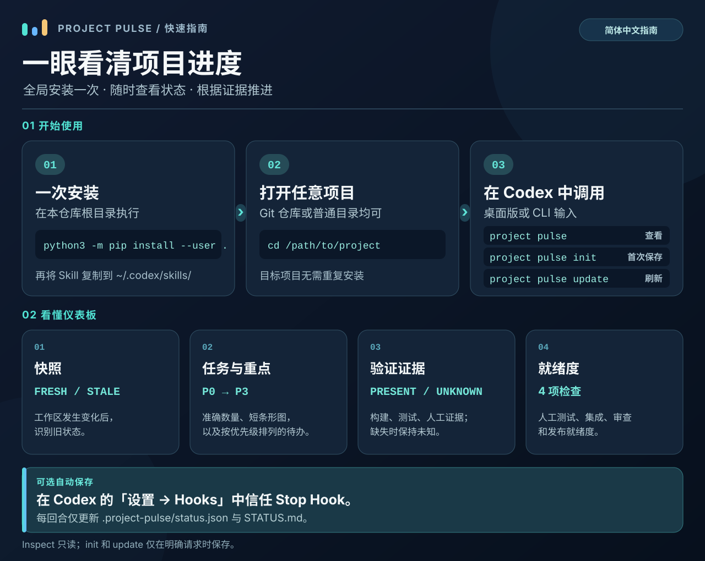

# Project Pulse

> 安装一次，跨所有项目使用。

[English README](README.md)

Project Pulse 是一个开源、基于证据的项目状态 Skill，服务于 Coding Agent 和开发者。它回答：**这个项目现在进行到哪里了？** 它严格区分实现、验证、就绪度、证据、推断和未知。

## 图解指南



[查看原尺寸信息图](docs/project-pulse-guide.zh-CN.svg)。下文提供可复制的安装命令和 Stop Hook 配置步骤。

## 核心能力

- 一次安装，可用于任意 Git、非 Git、monorepo、worktree 或原型项目。
- 初始化前即可只读检查。
- 使用 `.project-pulse/status.json` 保存可移植状态，生成 `STATUS.md` 作为交接面板。
- 命令行以紧凑、对齐的条形图概览状态；`STATUS.md` 使用 Markdown 表格和任务明细。
- 人类可读输出跟随进程或 macOS 首选语言（中文、英文）；状态 JSON 保持语言无关。
- 跨电脑、分支和 Agent 检测过期快照。
- 确定性计算 `implemented`、`verified`、`active`、`blocked` 和 `unknown`。
- 展示手工测试、集成测试、审查和发布就绪度。
- 无网络、无遥测、不执行项目代码、不安装依赖、不写 Git、不读取已知秘密文件。

## 一次安装

每台机器只需在仓库根目录执行一次，不必逐个项目安装。

```sh
git clone https://github.com/BreezeLife/Project-ProjectPulse.git
cd Project-ProjectPulse
python3 -m pip install --user .
```

Codex Skill 安装在全局目录 `~/.codex/skills/project-pulse`。只安装一次，目标项目不需要复制 Skill：

```sh
mkdir -p "$HOME/.codex/skills/project-pulse/references"
cp skills/project-pulse/SKILL.md "$HOME/.codex/skills/project-pulse/"
cp skills/project-pulse/references/*.md "$HOME/.codex/skills/project-pulse/references/"
```

## 在任意项目中使用

```sh
cd /path/to/any-project
project-pulse inspect       # 默认只读检查
project-pulse init          # 明确初始化，可选
project-pulse update        # 明确刷新
project-pulse inspect --json
```

在 Codex 中只保留一个主要的手动入口：

```text
project pulse
project pulse init
project pulse update
```

`project pulse` 是日常手动调用命令。需要显式调用 Skill 时使用 `$project-pulse`。完整报告按工作区快照、任务状态、验证证据、就绪度和下一步排列；可选的 Codex Stop Hook 则显示一屏摘要：任务数量、最多两项需关注任务，以及明确的下一步。推荐使用固定指令，不要使用可能被项目专用 Skill 接管的模糊指令，例如 `refresh status`。

每次打开目标项目后，直接在 Codex 输入 `project pulse` 即可；无需重新安装或初始化。若希望每回合结束自动看到简短摘要，可启用下方的 Stop Hook。

## 功能与结果解读

- **Inspect**：从当前目录找到项目根目录，读取任务声明与 Git 快照，生成只读状态报告；不需要先初始化。
- **仪表板**：命令行显示对齐的图标、准确数量和短条形图；有任务的状态排在零项状态之前。`init/update` 生成的 `STATUS.md` 将验证证据与就绪度并排展示。每个 `█` 代表一项任务，图形最多显示 20 格，数量始终准确。
- **重点事项**：统计图下方列出最多 5 条需要处理的具体任务，标出优先级和状态；完整任务明细仍在后面，Stop Hook 摘要显示前 2 条。可在勾选任务标题开头写 `[P0]` 到 `[P3]`（P0 最高），例如 `- [ ] [P0] 修复结账流程`。未标注的任务按状态及原文件顺序排列，不从措辞猜测优先级。
- 增删优先级标记不会改变任务身份，历史证据仍保留；和其他任务文件修改一样，当前验证仍需匹配新的项目指纹。
- **语言**：默认跟随进程语言，macOS 的中性终端语言则跟随系统首选语言。可用 `PROJECT_PULSE_LANG=zh_CN` 或 `PROJECT_PULSE_LANG=en` 明确指定。只翻译界面标签和提示，任务原文与 JSON 状态码不变。
- **Init / Update**：在用户明确调用时保存状态 JSON 和 `STATUS.md` 交接面板。工作区变化后，旧快照会标记为 `STALE`。
- **证据与就绪度**：已勾选任务只代表“已实现、未验证”。某类证据显示 `PRESENT`，表示至少一个已验证任务具有与当前快照匹配的构建、测试或人工证据，并不代表全项目通过。快照过期后，证据检查和就绪度回到 `UNKNOWN`。
- **Stop Hook**：启用后在 Codex 每回合结束时先自动保存状态 JSON 和 `STATUS.md`，验证保存结果后显示一屏摘要；不运行项目测试。

### 看板示例

生成的 `STATUS.md` 会把任务图表放在前面，接着列出重点事项（以下为示例数据）：

| 优先级 | 状态 | 事项 |
| --- | --- | --- |
| P0 | ○ 待完成 | 修复结账流程 |
| P1 | ◐ 已实现·待验证 | 验证 API 集成 |
| — | ! 阻塞 | 获取测试凭据 |

这里最多显示 5 条需要处理的任务，完整明细仍在下方。P0 最高；`—` 表示尚未明确标注优先级。

### 可选的 Codex Stop Hook

在用户级 `~/.codex/hooks.json` 的 `Stop` 数组中追加一组 Hook，保留现有配置。将 `command` 替换为 `command -v project-pulse-hook` 输出的绝对路径：

```json
{
  "hooks": {
    "Stop": [{"hooks": [{"type": "command", "command": "/absolute/path/to/project-pulse-hook", "timeout": 30, "statusMessage": "Saving Project Pulse progress"}]}]
  }
}
```

Codex 桌面版支持 Hook，可在应用内完成信任审核：打开 **设置 → Hooks**，核对 Project Pulse 的命令并信任它；若未显示新 Hook，再重启桌面版。CLI 则可使用 `/hooks` 或启动时的审核界面。每次 Stop 时，它仅更新 `.project-pulse/status.json` 与 `STATUS.md`，重新检查保存结果，再显示与环境语言一致的保存提示和简短状态。空目录会跳过；保存失败会显示不阻断回合的失败提示。它不会创建 `project-pulse.json`、运行测试或构建、改写任务或工作日志，也不会提交 Git。手动 `project pulse` 仍可使用。

如果找不到 `project-pulse-hook` 命令，先将 Python 用户脚本目录加入 PATH。macOS Python 3.9 常见目录是 `$HOME/Library/Python/3.9/bin`。

## 核心操作

| 操作 | 含义 | 是否写入 |
| --- | --- | --- |
| `inspect` | 发现并报告当前状态 | 否 |
| `init` | 创建项目配置、canonical state 和面板 | 是，需明确请求 |
| `update` | 更新已初始化的状态和面板 | 是，需明确请求 |
| 已启用的 Stop Hook | 自动保存当前状态和面板后显示摘要 | 是，仅两份状态文件 |
| `verify` | 未来的授权验证命令 | v0.1 未实现 |

项目本地文件是可选的：

```text
project-pulse.json
.project-pulse/status.json   # canonical machine state
STATUS.md                    # 生成的人类可读面板
```

工作区变化后，保存的快照会显示为 `STALE`。状态文件属于项目；Skill 和核心代码保持全局安装。

## 适用场景

适合新会话、切换电脑或 Agent、人和 Agent 交接、多 Agent 分支、Git worktree、陌生仓库、没有任务文件的原型，以及“现在能测试什么”“是否可以审查”“是否可以发布”等问题。详见 [用户场景](docs/scenarios.md)。

## 安全边界

Inspect 把仓库内容视为不可信数据。它不会执行代码或仓库指令，不运行构建和测试，不安装依赖，不访问网络，不读取已知秘密文件，不跟随 symlink 逃出项目，也不执行 Git 写操作。Init 和 Update 只有在明确请求后才写入固定项目路径；启用的 Stop Hook 只写两份状态文件。详见 [SECURITY.md](SECURITY.md) 和 [THREAT_MODEL.md](THREAT_MODEL.md)。

## 文档

- [English README](README.md)
- [Skill 入口](skills/project-pulse/SKILL.md)
- [协议](skills/project-pulse/references/protocol.md)
- [证据模型](skills/project-pulse/references/evidence.md)
- [安全契约](SECURITY.md)
- [用户场景](docs/scenarios.md)
- [贡献指南](CONTRIBUTING.md)
- [变更记录](CHANGELOG.md)

## 开发与测试

```sh
python3 -m unittest discover -s tests -v
python3 -m compileall -q project_pulse
python3 -m project_pulse inspect
```

## 路线图

v0.1 提供通用 Skill、安全发现、Inspect、Init、Update、指纹、可移植状态、渲染器、CLI、安全测试和场景文档。可选 Codex Stop Hook 是适配器；后续版本可以增加更强的平台安全防护、其他 Agent 适配器和显式 Verify 模式。

## 许可证

MIT，详见 [LICENSE](LICENSE)。
